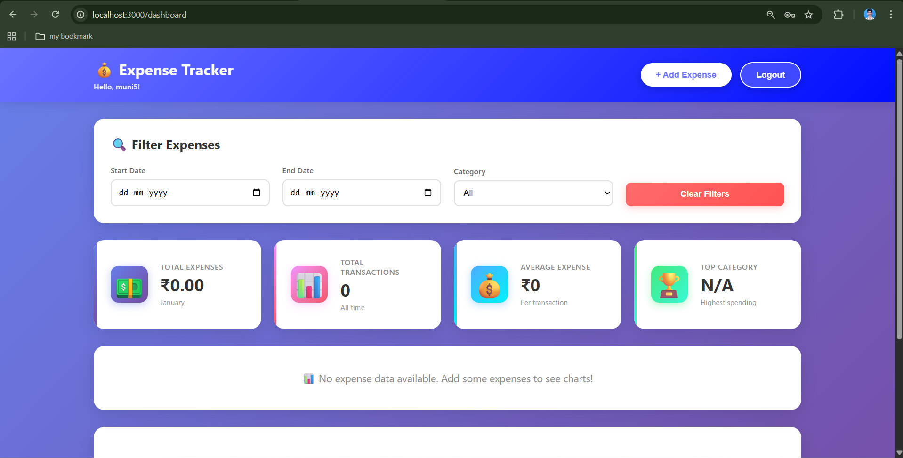
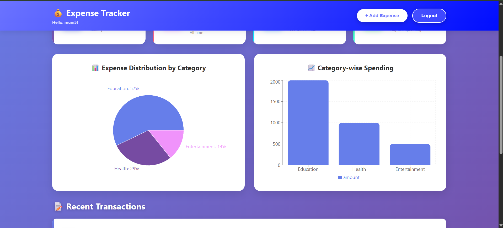
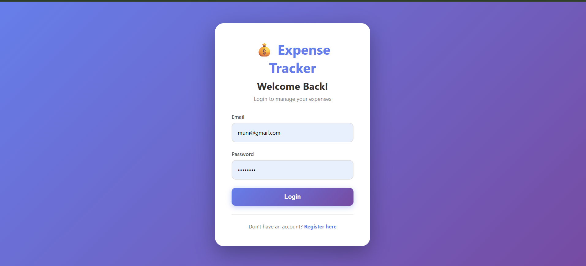

# 💰 Expense Tracker

A simple and powerful expense tracking application to manage your daily expenses.

## ✨ What This App Does

- Track your daily expenses
- See your spending with colorful charts
- Filter expenses by date and category
- Secure login and registration
- Works on phone, tablet, and computer

## 🖼️ Features

✅ Add, edit, and delete expenses  
✅ Organize by 8 categories (Food, Transport, Shopping, etc.)  
✅ Beautiful pie charts and bar graphs  
✅ Filter by date range and category  
✅ Dashboard with spending statistics  
✅ User authentication (your data is private)  
✅ Fully responsive design  

## 🛠️ Built With

**Frontend:** React + Vite  
**Backend:** Node.js + Express  
**Database:** MongoDB  
**Charts:** Recharts  
**Authentication:** JWT  

## 🚀 How to Run

### 1. Clone the project
```bash
git clone https://github.com/mune07/ExpenseTracker.git
cd ExpenseTracker
```

### 2. Setup Backend
```bash
cd Backend
npm install
```

Create `.env` file in Backend folder:
```
PORT=5000
MONGODB_URI=mongodb://localhost:27017/expense-tracker
JWT_SECRET=your_secret_key_here
```

Start backend:
```bash
npm start
```

### 3. Setup Frontend
```bash
cd Frontend
npm install
npm run dev
```

### 4. Open Browser
Go to: `http://localhost:3000`

## 📸 Screenshots

[Add your app screenshots here]

## 👤 Author

**Muneendra**  
GitHub: [@mune07](https://github.com/mune07)

## 📝 License

Free to use for learning and portfolio projects.

## 📸 Screenshots

### 🏠 Dashboard with Statistics


### 📊 Interactive Charts


### 🔐 Secure Login

